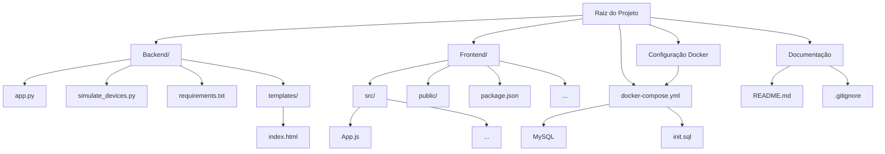
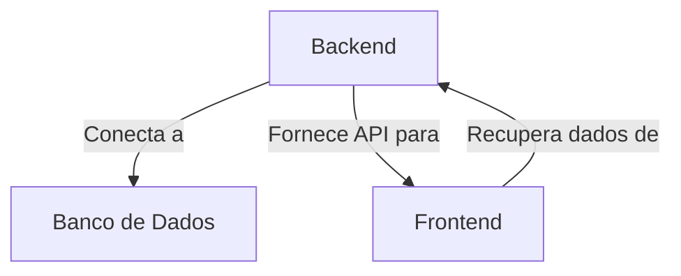

# Sistema de Home Care IoT

- Este repositório contém o Sistema de Home Care IoT, uma solução para simular, ingerir e visualizar dados de dispositivos IoT via navegador web. 
- O sistema inclui serviços de backend possuindo uma API para ingestão de dados, bem como uma interface de frontend para visualização do status e métricas dos dispositivos. 
- Toda a aplicação está conteinerizada usando Docker para garantir fácil implantação.

## Índice

1. [Visão Geral do Sistema](#visão-geral-do-sistema)
   - [Diagrama 1: Estrutura do Projeto](#diagrama-1-estrutura-do-projeto)
   - [Diagrama 2: Processo Simplificado](#diagrama-2-processo-simplificado)
2. [Arquitetura](#arquitetura)
   - [simulate_devices](#simulate_devices)
   - [app.py](#apppy)
   - [Frontend](#frontend)
3. [Simulador de Dispositivos IoT](#simulador-de-dispositivos-iot)
   - [Funcionalidades](#funcionalidades)
   - [Estrutura do Script](#estrutura-do-script)
   - [Critérios de Envio de Dados](#critérios-de-envio-de-dados)
     - [Dados Históricos](#dados-históricos)
     - [Envio de Dados em Tempo Real](#envio-de-dados-em-tempo-real)
     - [Controle de Taxa de Simulação](#controle-de-taxa-de-simulação)
4. [Backend (app.py)](#backend-apppy)
   - [Funcionalidades](#funcionalidades-1)
   - [Estrutura do Script](#estrutura-do-script-1)
     - [Configuração do Banco de Dados](#configuração-do-banco-de-dados)
     - [Configuração de Logging](#configuração-de-logging)
     - [Endpoints](#endpoints)
5. [Frontend (App.js)](#frontend-appjs)
   - [Descrição Geral](#descrição-geral)
   - [Funcionalidades](#funcionalidades-2)
   - [Componentes Personalizados](#componentes-personalizados)
   - [Rotas Definidas](#rotas-definidas)
6. [Primeiros Passos e Uso](#primeiros-passos-e-uso)
   - [Pré-requisitos](#pré-requisitos)
   - [Passo a Passo para Executar o Sistema](#passo-a-passo-para-executar-o-sistema)


## Visão Geral do Sistema

#### Diagrama 1: Estrutura do Projeto




#### Diagrama 2: Processo Simplificado



## Arquitetura

O sistema consiste em três componentes principais:

1. **simulate_devices**: Gera e envia dados de dispositivos IoT simulados.
2. **app.py**: Uma aplicação Flask que lida com a ingestão de dados, processamento e fornece APIs para o frontend.
3. **Frontend**: Uma aplicação React que visualiza os dados e status dos dispositivos.


## Simulador de Dispositivos IoT

### Funcionalidades

- **Simulação de Dados**: Gera dados de dispositivos IoT, incluindo eventos de power on/off e mensagens de status com possíveis códigos de erro.
- **Ingestão de Dados**: Envia dados gerados para uma API de backend para ingestão e armazenamento.
- **Dados Históricos**: Popula o banco de dados com dados históricos para testes mais realistas.
- **Controle de Taxa**: Controla a taxa de envio de dados para evitar sobrecarga no sistema.

### Estrutura do Script

1. **Configuração do Banco de Dados**: Conecta ao banco de dados MySQL usando variáveis de ambiente para a configuração.
2. **Lista de IMEIs**: Gera uma lista de IMEIs para os dispositivos simulados.
3. **Dicionários de Status e Erros**: Mantém o status de cada dispositivo e o último código de erro registrado.
4. **Funções de Conexão**: Funções auxiliares para conectar ao banco de dados e inserir dados.
5. **Funções de Simulação**: Funções que geram e enviam dados simulados para a API de backend.
6. **Controle de Taxa de Simulação**: Limita o número de dispositivos ativos enviando dados simultaneamente para evitar sobrecarga.

### Critérios de Envio de Dados

#### 1. Dados Históricos

A função `insert_historical_data` gera dados históricos para cada dispositivo:

- **Período**: Simula dados para os últimos 2 dias.
- **Eventos**: Gera um evento por dia para cada dispositivo, que pode ser 'poweron', 'poweroff' ou 'timebased'.
- **Códigos de Erro**: Para eventos 'timebased', há uma chance de 0.5% de gerar os códigos de erro 'BAD_CONFIGURATION' ou 'MEMORY_FAILURE'.
- **Inatividade**: Há uma chance de 0.2% de um dispositivo se tornar inativo em qualquer dia.

#### 2. Envio de Dados em Tempo Real

As funções `send_timebased_data` e `simulate_power_cycle` simulam o envio de dados em tempo real:

- **Intervalos**: 
  - Dados 'timebased' são enviados a cada 30 segundos.
  - Eventos de 'poweron' e 'poweroff' ocorrem em intervalos aleatórios entre 20 segundos e 2 minutos.
- **Códigos de Erro**: 
  - 'timebased' tem uma chance de 0.5% de gerar um código de erro, com 99% de chance de ser 'NO_ERROR'.
- **Inatividade**: 
  - Há uma chance de 0.1% de um dispositivo se tornar inativo após qualquer envio de dados.

#### 3. Controle de Taxa de Simulação

A função `control_simulation_rate` limita o número de dispositivos ativos:

- **Número de Dispositivos**: Seleciona aleatoriamente até 10 dispositivos para enviar dados a cada 30 segundos.
- **Threads**: Cada dispositivo ativo executa suas próprias threads para enviar dados 'timebased' e eventos de 'poweron/poweroff'.


## Backend (app.py)

### Funcionalidades

- **Ingestão de Dados**: Recebe dados de dispositivos IoT via um endpoint HTTP POST e armazena em um banco de dados.
- **Consultas de Estado dos Dispositivos**: Fornece endpoints para verificar dispositivos ativos, inativos e o status de falhas.
- **Comunicação em Tempo Real**: Utiliza WebSocket para enviar dados atualizados em tempo real aos clientes conectados.

### Estrutura do Script

1. **Configuração do Banco de Dados**: Conecta ao banco de dados MySQL usando variáveis de ambiente para a configuração.
2. **Configuração de Logging**: Configura o nível de logging para coletar informações sobre o processamento de dados.
3. **Endpoints**:
   - `/data`: Ingestão de dados de dispositivos.
   - `/`: Página inicial.
   - `/inactive_devices`: Consulta de dispositivos inativos.
   - `/device_status`: Consulta do estado dos dispositivos (on/off).
   - `/device_status/<imei>`: Consulta do estado específico de um dispositivo.
   - `/device_failures`: Consulta de falhas dos dispositivos.

## Frontend (App.js)

### Descrição Geral

O script `app.js` é a principal aplicação React responsável pela interface de usuário do dashboard de IoT Home Care. Ele fornece uma interface amigável para visualizar o status dos dispositivos IoT, incluindo dispositivos ativos, inativos, falhas e o estado dos dispositivos.

### Funcionalidades

- **Navegação**: Barra de navegação no topo da aplicação para acessar diferentes seções.
- **Cartões de Navegação**: Cartões na página inicial que direcionam para páginas específicas com informações sobre dispositivos.
- **Componentes Dinâmicos**: Usa Material UI e React Router para criar uma interface responsiva e dinâmica.

### Componentes Personalizados

- **CardStyled**: Estiliza os cartões de navegação.
- **IconStyled**: Estiliza os ícones usados nos cartões.

### Rotas Definidas

- `/`: Página inicial com resumo e navegação para diferentes seções.
- `/active_devices`: Página para visualizar dispositivos ativos.
- `/inactive_devices`: Página para visualizar dispositivos inativos.
- `/device_status`: Página para visualizar o estado dos dispositivos.
- `/device_failures`: Página para visualizar falhas nos dispositivos.


## Primeiros Passos e Uso

### Pré-requisitos

Certifique-se de ter o seguinte instalado:

- [Docker](https://www.docker.com/get-started)
- [Docker Compose](https://docs.docker.com/compose/install/)

### Passo a Passo para Executar o Sistema

1. Clone o repositório:

    ```bash
    git clone https://github.com/BrenoVinheiros/DesafioTecnico.git
    cd DesafioTecnico
    ```

2. Construa e inicie os containers Docker:

    ```bash
    docker-compose up --build
    ```

  Isso iniciará o banco de dados MySQL, o servidor Flask backend e o servidor React frontend.

3. Acesse o frontend no navegador

    ```bash
    http://localhost:3000
    ```

4. Rodar simulação de dados

    ```bash
    docker-compose run simulator
    ```
